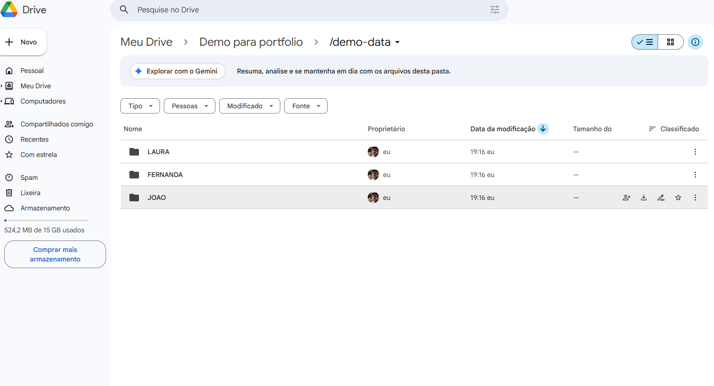
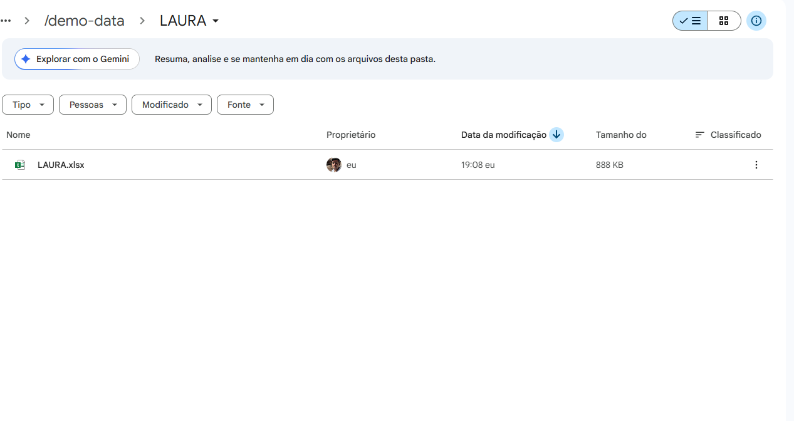
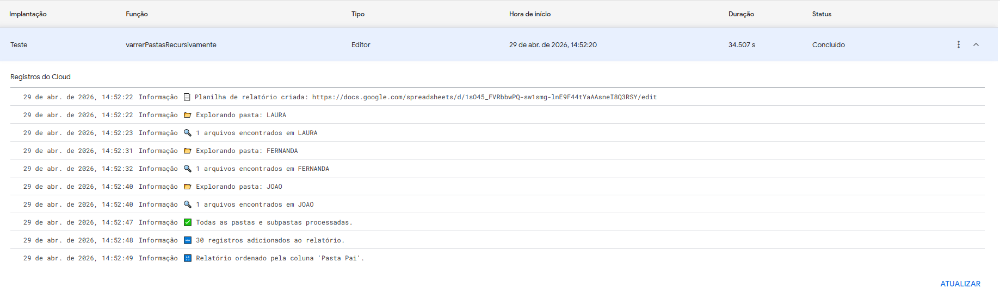
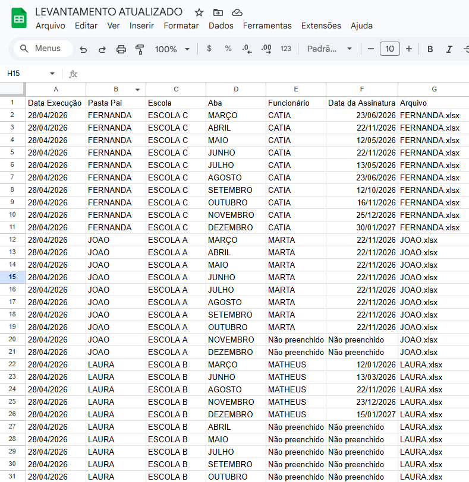

Automação de Auditoria de Relatórios em Excel

Sobre o projeto
Automação desenvolvida para eliminar a conferência manual de relatórios em arquivos Excel distribuídos em múltiplas pastas.

Problema
A verificação manual de relatórios demandava várias horas e estava sujeita a erros humanos.

Solução
Script em Google Apps Script que:

- Varre pastas e subpastas automaticamente
- Identifica arquivos .xlsx
- Extrai dados de células específicas (M45, D45, B26)
- Verifica preenchimento (assinatura)
- Consolida tudo em uma planilha única
- Atualiza a planilha a cada execução sem remover dados anteriores

Demonstração

Estrutura dos arquivos

Execução do script

Resultado consolidado

Tecnologias
- Google Apps Script
- JavaScript (V8)
- Google Drive API
- Google Sheets API

Como usar

1. Crie uma pasta no Google Drive
2. Crie uma subpasta com nome do funcionário fictício
3. Adicione arquivos demo-data/RELATORIO EXEMPLO.xlsx
4. Renomeie os arquivos.xlsx com o nome dos funcionários
5. Insira o ID da pasta no código
6. Execute a função principal

Observações

- Projeto adaptado para demonstração. Dados reais foram removidos por privacidade.
- Caso volume grande de arquivos para conferência, adicionar acionadores de tempo de a cada 10 minutos executar novamente para continuar a atualização da planilha.

Resultado

Redução significativa do tempo de conferência manual para execução automatizada.

Cenário de uso

Aplicável em processos administrativos, auditorias internas e conferência de relatórios em larga escala.
